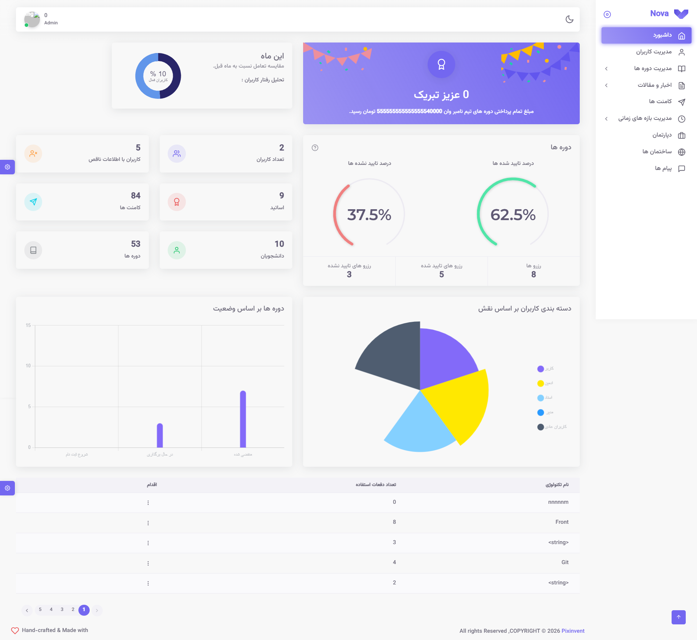

<div align="center">

# 🛠️ Nova Admin Panel

### Administration Dashboard for the Nova E-Learning Platform

*A modern admin dashboard designed to manage courses, users, blogs, schedules, mentors, and platform content with a clean and scalable interface.*

<br>


</div>

---

## 📖 About
> 🔗 This is the admin dashboard for the [Nova E-Learning Platform](https://github.com/react-summer-1404/Nova).
Nova Admin Panel is the management dashboard for the Nova e-learning platform. It gives administrators and mentors full control over courses, users, academic structure, and content — all from a single, responsive interface.

<br/>

## 🗂️ Modules Overview

| Module | Description |
|---------|-------------|
| 📊 Dashboard | Platform statistics, reports, and analytics overview |
| 👥 Users | Manage users, view details, assign roles |
| 📚 Courses | Create, edit, and organize courses via a multi-step wizard |
| 📰 Blogs & News | Manage educational articles and news content |
| 💬 Comments | Moderate user comments |
| 👨‍🏫 Mentors | Manage mentor profiles |
| 📅 Schedules | Manage class schedules |
| 🏢 Departments | Manage academic departments |
| 🎓 Terms & Levels | Manage academic terms and course levels |
| 🎯 Technologies | Manage technology/skill categories |

<br/>

## ✨ Key Features

- **JWT authentication** with protected, role-based routes
- **Multi-step course creation wizard**
- **AI-powered text correction** for content editing
- **Interactive maps** (Leaflet) for location-based data
- **Rich text editing** via Editor.js
- **Fully responsive** dashboard layout

<br/>

## 🛠 Tech Stack

### ⚛️ Frontend


### 🎨 UI & Styling


### 📝 Forms & Editors


### 🔧 Tools & Services


<br/>

## 📷 Screenshots

### Dashboard


### User Management


### Course Management


### Blog Management


<br/>

## 📂 Project Structure

```text
src
├── @core            # Core components, layouts and utilities
├── assets           # Static assets
├── configs          # Application configuration
├── core             # API services, hooks and storage
├── layouts          # Dashboard layouts
├── navigation       # Sidebar and navigation configuration
├── pages            # Authentication and general pages
├── redux            # Global state management
├── router           # Application routing
├── utility          # Helper functions
├── views            # Main application modules
└── index.js
```
<br/>

## 🚀 Getting Started

### Prerequisites

- **Node.js** v20 or later
- **npm** (or another compatible package manager such as pnpm)

### 1. Clone the Repository

```bash
git clone https://github.com/react-summer-1404/Nova-admin-panel
```

### 2. Install Dependencies

```bash
npm install
```

### 3. Configure Environment Variables

Create a `.env` file in the project root:

```env
VITE_API_URL=https://sepehracademy.liara.run
```

| Variable | Description | Required |
|-----------|-------------|----------|
| `VITE_API_URL` | Base URL of the backend API | ✅ |


### 4. Start the Development Server

```bash
npm run dev
```

The application will be available at `http://localhost:5173`.

### 5. Build for Production

```bash
npm run build
```

### 6. Preview the Production Build

```bash
npm run preview
```
<br/>

## 👥 Team

Nova was collaboratively developed by a team of developers as an educational software project, covering frontend architecture, UI implementation, and API integration for a modern programming e-learning platform.

---

<div align="center">

Made with ❤️ by **Nova Team**

⭐ If you like this project, consider giving it a star on GitHub.

</div>
